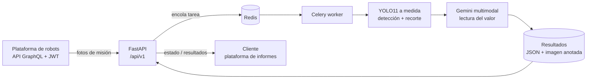

# 👁️ Level Gauge Vision — Lectura automática de medidores con YOLO + LLM

Servicio en producción que **lee automáticamente medidores de nivel** a partir de las fotos que toman robots de inspección autónoma en una planta petroquímica. Detecta el instrumento con un **modelo YOLO entrenado a medida**, interpreta la lectura con un **modelo multimodal (Gemini)** y devuelve el valor, el identificador del equipo y la imagen anotada.

> **Nota:** este repositorio es un **caso de estudio anonimizado**. Describe un sistema real que he diseñado y que está en producción para un cliente industrial. No contiene código ni datos porque son confidenciales; el objetivo es mostrar la arquitectura, las decisiones técnicas y cómo trabajo con estas tecnologías.

## 🎯 El problema

Un robot recorre la planta y fotografía cientos de puntos de interés por misión. Entre ellas hay medidores de nivel (visores de vidrio, indicadores magnéticos) cuya lectura, hasta ahora, revisaba una persona foto a foto. Lento, caro y propenso a error.

## 💡 La solución

Un pipeline híbrido **visión clásica + LLM** que aprovecha lo mejor de cada uno:

1. **YOLO (detector a medida)** localiza el instrumento en la imagen. Cinco clases entrenadas sobre dataset propio: `nivel_liquido`, `nivel_magnetico`, `brida`, `rejilla` y un identificador de equipo. Modelo YOLO11m afinado; iteración v0.6.0 con trazabilidad de métricas y hash del checkpoint.
2. **Gemini (visión multimodal)** recibe **solo el recorte** del instrumento con un prompt estructurado y devuelve el valor porcentual y el identificador legible. Recortar antes de preguntar al LLM multiplica la precisión y divide el coste.
3. **Anotación y resultado**: bounding box, lectura y confianza sobre la imagen original; JSON con todas las lecturas de la misión.

## 🏗️ Arquitectura

**Cómo se conjuntan las piezas:** la API recibe la orden de analizar una misión o un día completo, lista las fotos vía GraphQL y encola una tarea por misión. El worker descarga las imágenes, pasa cada una por YOLO, recorta cada instrumento detectado y se lo entrega a Gemini con un prompt estructurado (JSON de salida obligatorio). El resultado se persiste y la API lo sirve para que la plataforma de informes lo incruste en el PDF diario.

## 🧰 Stack

| Capa | Tecnologías |
|---|---|
| Visión / IA | YOLO11 (Ultralytics) entrenado a medida · Gemini (multimodal) · OpenCV |
| Backend | Python 3.11 · FastAPI (API REST versionada `/api/v1`) · Pydantic · Poetry |
| Procesamiento | Celery + Redis (tareas asíncronas, estados `pending / in_progress / completed / failed`) |
| Integración | Cliente GraphQL con JWT y renovación automática de token |
| Infra | Docker Compose (API + worker + Redis + init de permisos) · healthchecks · Makefile |
| Calidad | black · isort · ruff · flake8 · mypy · pre-commit · tests unitarios e integración |

## ⚙️ Aspectos de ingeniería destacados

- 🔁 **Análisis idempotente** por misión con `force` para re-ejecutar y endpoint para resetear estados atascados.
- 🔐 **Autenticación por API key** con endpoints públicos de `healthcheck` e `info` para monitorización externa.
- 📦 **Trazabilidad del modelo**: versión, dataset, métricas y SHA-256 del checkpoint documentados; pesos antiguos purgados tras validar despliegue.
- 💸 **Coste controlado**: el LLM solo ve recortes, ~2-3 s por instrumento, temperatura 0 para lecturas deterministas.
- 🧪 **Configuración tipada** con `pydantic-settings`; nada sensible en código.

## 🔬 Cómo trabajo con estas tecnologías

- **Dataset propio**: etiquetado de imágenes reales de planta, con clases pensadas para el problema (no genéricas), y reentrenos versionados a medida que llegan casos difíciles (reflejos, suciedad, ángulos).
- **Evaluación antes de desplegar**: cada versión del modelo se compara contra la anterior sobre un conjunto de validación fijo; solo sube a producción si mejora mAP y no empeora falsos positivos.
- **LLM como lector, no como detector**: el modelo multimodal es caro y lento sobre imágenes completas; usarlo solo sobre recortes hace el sistema viable en coste y precisión.
- **Operable por otros**: Swagger, healthchecks, Makefile y `docker compose up` para que el equipo de planta lo despliegue sin mí.

## 👤 Mi rol

Diseño y desarrollo completo: etiquetado y entrenamiento del detector, diseño del pipeline híbrido, API, workers, integración con la plataforma de robots y despliegue en planta.

## 📬 Contacto

Ander Sein · [LinkedIn](https://www.linkedin.com/in/ander-sein-a24097195/) · aseinotegi@gmail.com
